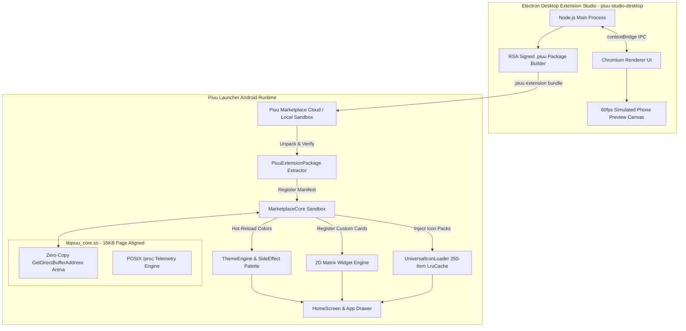

# 🤖 Piuu Launcher — Developer & Agent Guide (`AGENTS.md`)

This document serves as the authoritative guide for AI Coding Agents and Human Developers working on the **Piuu Unified Launcher** codebase.

---

## 🏛️ System Architecture Overview

Piuu Unified Launcher is a hybrid, high-performance Android launcher built with **Kotlin Jetpack Compose** for modern UI/UX and a **POSIX C Native Shared Core (`libpiuu_core.so`)** for sub-millisecond telemetry and zero-copy JNI memory buffer operations.

---

## 🔑 Key Components & Architectural Modules

### 1. POSIX C Native Shared Core (`app/src/main/cpp/piuu_core.c` & `piuu_core.h`)
* Compiled with CMake linker flag `-Wl,-z,max-page-size=16384` for Android 16 memory alignment.
* Implements direct memory arena buffers (`GetDirectBufferAddress`) to communicate with Kotlin Jetpack Compose without Java Garbage Collection (GC) latency pauses.
* Implements POSIX `/proc` system telemetry polling with SELinux exception fallbacks in [`LibC.kt`](file:///data/data/com.termux/files/home/repo/Piuu-Unified-Launcher-Android/app/src/main/java/com/piuu/launcher/repository/LibC.kt).

### 2. Extension Package Extractor (`app/src/main/java/com/piuu/launcher/marketplace/PiuuExtensionPackage.kt`)
* Unpacks `.piuu` zip bundle archives into the local SDK sandbox (`files/custom_plugins/`).
* Validates `plugin.json` manifest syntax against `PiuuPluginSdk` rules.
* Computes SHA-256 integrity hashes for package verification.

### 3. Electron Desktop Extension Studio (`piuu-studio-desktop/`)
* Cross-platform desktop tool (Electron + Node.js + HTML5) for extension creators on Linux, macOS, and Windows.
* **Main Process ([`main.js`](file:///data/data/com.termux/files/home/repo/Piuu-Unified-Launcher-Android/piuu-studio-desktop/main.js))**: Asynchronous zip compiler and SHA-256 package hasher.
* **Preload Bridge ([`preload.js`](file:///data/data/com.termux/files/home/repo/Piuu-Unified-Launcher-Android/piuu-studio-desktop/src/preload.js))**: Safe `window.piuuStudio` IPC API.
* **Phone Canvas ([`index.html`](file:///data/data/com.termux/files/home/repo/Piuu-Unified-Launcher-Android/piuu-studio-desktop/src/index.html))**: Live 60fps simulated phone preview frame with color pickers and 1-click bundle export.

### 4. 2D Matrix Grid Resizing & Context Hub ([`HomeScreen.kt`](file:///data/data/com.termux/files/home/repo/Piuu-Unified-Launcher-Android/app/src/main/java/com/piuu/launcher/ui/components/HomeScreen.kt))
* **4-Column Android Standard**: Grid layout aligned to `GridCells.Fixed(4)` with dynamic 1–4 column span mapping.
* **2D Matrix Resizing**: Interactive edit handles for 1x1 up to 4x4 width (`W:1..4`) and height (`H:1..4`) adjustments.
* **Empty-Space Context Hub**: Long-pressing empty homescreen space opens the **Piuu Context Hub** containing widget pickers, app shortcut pinners, wallpaper color harmonizer, and the **1-Tap Theme Transformer Studio**.

### 5. 60fps Scrolling Icon Loader ([`UniversalIconLoader.kt`](file:///data/data/com.termux/files/home/repo/Piuu-Unified-Launcher-Android/app/src/main/java/com/piuu/launcher/repository/UniversalIconLoader.kt))
* Singleton in-memory `ImageBitmap` 250-item `LruCache` providing $O(1)$ fast rendering during fast vertical scrolling in the App Drawer.

---

## 🌿 Git Branching Strategy, Nicknames & Rules

### Branch Nicknames
* **`piuu`** = **`main`** Branch: Production-stable baseline launcher containing standard components, 4-column Android grid, 2D matrix resizing, app shortcut picker, and element removal.
* **`zen-piuu`** = **`master`** Branch: Extension architecture & core planned branch containing `PiuuExtensionPackage` bundle extractor, `piuu-studio-desktop` Electron builder, 1-Tap Theme Transformer Studio, and Master Architectural Plans.

### Strict Branch Operating Rules (See [`BRANCHING_RULES.md`](file:///data/data/com.termux/files/home/repo/Piuu-Unified-Launcher-Android/BRANCHING_RULES.md))
1. **Never Develop Both Branches Simultaneously**: Working on both branches in the same turn creates system conflicts. Always focus exclusively on one target branch per task.
2. **Always Confirm Branch Target**: Before executing changes or pushing code, clarify or confirm which branch is being targeted (`piuu` / `main` vs `zen-piuu` / `master`).

---

## 🛠️ Instructions for Future AI Agents & Developers

1. **Obey Branch Nicknames & Rules**: `piuu` refers to `main`; `zen-piuu` refers to `master`. Never touch both branches simultaneously.
2. **Obey Explicit Directives**: Always verify component parameters and signatures before passing properties (e.g., `LauncherTheme` uses `bg_overlay` and `primary_color`, not `card_glass`).
3. **Never Guess Code Logic or Schemas**: Use `view_file` and `grep_search` to inspect data classes before modifying function invocations.
4. **Preserve Native C Core Compatibility**: When editing C code in `app/src/main/cpp/`, ensure POSIX headers (`dirent.h`, `signal.h`, `unistd.h`) are included and CMake 16 KB page size alignment flags are retained.
5. **Synchronous Theme Composition**: Use Compose `SideEffect` in `Theme.kt` when mutating active theme colors to prevent 1-frame visual flashes.
6. **Always Verify Builds**: Verify CI/CD workflow status via `gh run list` after pushing commits.
