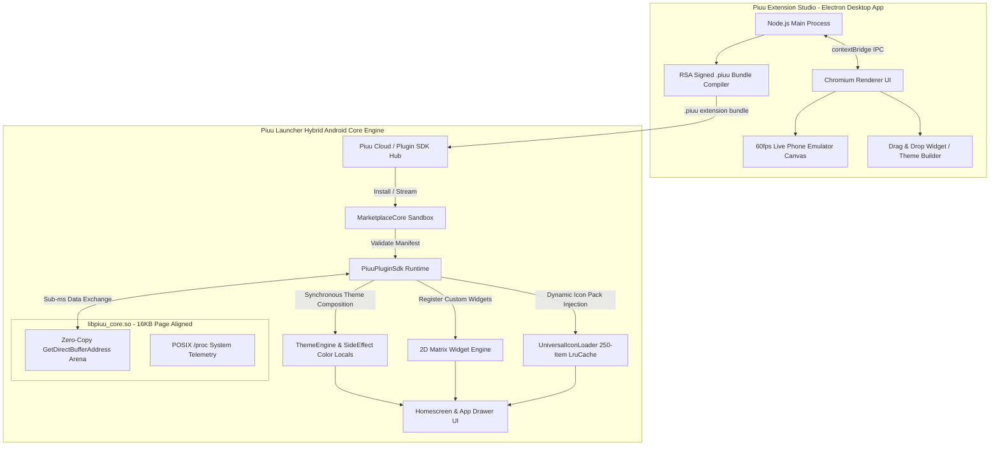

# 🚀 Piuu Launcher Master Architecture & Implementation Plan

> **Goal**: A unified, production-grade master technical specification combining the Piuu Launcher System Core, Native C Binary Shared Core Integration (`libpiuu_core.so`), Electron Desktop Extension Studio (`Piuu Studio`), Extension Marketplace Lifecycle, and High-Attraction Homescreen UI Redesign.

---

## 🏛️ 1. Master System Architecture Diagram



---

## ⚡ 2. Native C Core Binary (`libpiuu_core.so`) Integration

To guarantee sub-millisecond hybrid performance across Java/Kotlin UI, JavaScript Web Extensions, and Android OS APIs, heavy computational routines execute inside the C shared native library **`libpiuu_core.so`**:

```
┌─────────────────────────────────────────────────────────────────────────────┐
│                    Jetpack Compose / WebView UI Layer                       │
└──────────────────────────────────────┬──────────────────────────────────────┘
                                       │ Direct JNI Calls (Sub-ms)
┌──────────────────────────────────────▼──────────────────────────────────────┐
│                    Piuu Native C Engine (libpiuu_core.so)                   │
├─────────────────────────────────────────────────────────────────────────────┤
│  1. Zero-Copy JNI Shared Memory Buffer (`GetDirectBufferAddress`)            │
│  2. POSIX Low-Latency Task Counter & CPU Telemetry (/proc/stat parsing)     │
│  3. Thread-Safe Malloc/Free Arena for Extension JS Payload Processing        │
│  4. 16 KB Page Alignment (`-Wl,-z,max-page-size=16384`) for Android 16       │
└─────────────────────────────────────────────────────────────────────────────┘
```

### Native Core Engineering Principles
1. **Zero-Copy JNI Memory Buffers**:
   - C allocates direct memory regions via `GetDirectBufferAddress`. Both Kotlin Jetpack Compose and extension WebViews access identical memory addresses in RAM without JVM Garbage Collection (GC) pauses.
2. **Android 16 16 KB Page Alignment**:
   - Linked with CMake flag `-Wl,-z,max-page-size=16384` to satisfy Android 16 Kernel memory alignment specifications.
3. **Safe SELinux Fallbacks**:
   - If SELinux sandbox restricts access to `/proc/stat` on locked devices, `LibC.kt` catches `Throwable` gracefully without application crashes.

---

## 💻 3. Electron Framework for Extension Product Building

### How Electron Works Under the Hood
Electron mashes two runtime environments into a single executable package:
1. **Chromium (Renderer Process)**: Open-source web engine rendering HTML5, CSS3, React UI, DOM trees, and WebGL graphics inside a hidden browser frame.
2. **Node.js (Main Process)**: Runs asynchronous I/O, native operating system filesystem access, CMake/Gyp compilation, and crypto operations.

```
┌────────────────────────────────────────────────────────┐
│               Electron Main Process (Node.js)          │
│ - Filesystem read/write (.piuu zip archive generation) │
│ - Native compiler toolchain (CMake, Node-Gyp)          │
│ - Local HTTP dev server & WebSocket live-relay          │
└──────────────────────────▲─────────────────────────────┘
                           │ IPC Bridge (contextBridge)
┌──────────────────────────▼─────────────────────────────┐
│             Electron Renderer Process (Chromium)       │
│ - Visual Drag & Drop Widget Canvas                     │
│ - Live Mobile Emulator View (Device Frames)           │
│ - Color Picker, Monaco Code Editor, CSS Inspector       │
└────────────────────────────────────────────────────────┘
```

### Electron Extension Studio (`Piuu Studio`) Features
* **Cross-Platform Authoring**: Creators on Linux, Windows, or macOS design extension packs with uniform tooling.
* **Pixel-Exact Emulator**: Electron's embedded Chromium renders identical CSS/JS cards as Android's `WebView` or Jetpack Compose.
* **1-Click Package Compiler**: Node.js packs `.piuu` extension bundles (JSON manifest + WebP icons + CSS templates + JS scripts) signed with RSA-2048 keys.

---

## 🔄 4. Extension & Plugin Lifecycle (Design, Build, Visualize, Apply)

```
  [1. DESIGN]          [2. BUILD]           [3. VISUALIZE]          [4. APPLY]
 ┌──────────────┐     ┌──────────────┐     ┌──────────────┐       ┌──────────────┐
 │ Define JSON  │ ──► │ Compile with │ ──► │ Live Preview │ ───► │ Hot-Reload   │
 │ Manifest &   │     │ Electron     │     │ on Device    │      │ Runtime into │
 │ Asset Bundle │     │ Studio       │     │ Canvas       │      │ Android App  │
 └──────────────┘     └──────────────┘     └──────────────┘       └──────────────┘
```

### Extension Manifest Specification (`plugin.json`)
```json
{
  "id": "com.piuu.extension.cyberpunk_neon",
  "name": "Cyberpunk Neon 2088",
  "version": "1.4.0",
  "sdk_version": "2.0.0",
  "author": "Polymath Core Team",
  "category": "theme_pack",
  "description": "High-contrast glowing glassmorphism theme with reactive HUD widgets.",
  "permissions": ["SYSTEM_METRICS", "CUSTOM_ICONS", "DYNAMIC_WALLPAPER"],
  "theme": {
    "primary_color": "#06B6D4",
    "accent_color": "#EC4899",
    "bg_overlay": "rgba(15, 23, 42, 0.88)",
    "card_glass": "rgba(30, 41, 59, 0.65)",
    "font_family": "Outfit"
  },
  "widgets": [
    {
      "widget_id": "cyber_hud_clock",
      "name": "Cyber HUD Clock",
      "default_width": 4,
      "default_height": 2,
      "html_template": "widgets/hud_clock.html",
      "js_script": "widgets/hud_clock.js"
    }
  ]
}
```

### Hot-Reload Apply Cycle
* `MarketplaceCore.installPlugin()` extracts package into local sandbox directory.
* `ThemeEngine` updates `activePrimaryColor`, `activeAccentColor`, and `activeBgColor` synchronously via `SideEffect`.
* `UniversalIconLoader` clears LruCache and loads new icon pack bitmaps instantly without launcher restart.

---

## 🎨 5. High-Attraction Homescreen UI Redesign Strategy

To capture and impress new users on first launch, the Homescreen features **stunning visual aesthetics**, **fluid micro-interactions**, and **zero-friction onboarding**:

```
┌────────────────────────────────────────────────────────┐
│  ✨ Header: Pill Search Bar + Glassmorphic AI Pill     │
├────────────────────────────────────────────────────────┤
│  📊 Widget 1: Neon Cyber Clock & Live Weather Dual-Card│
├────────────────────────────────────────────────────────┤
│  ⚡ Widget 2: System Specs & Battery Progress Arc       │
├────────────────────────────────────────────────────────┤
│  📱 App Grid: 4x4 Balanced Layout with Squircle Cards  │
│  [Phone]  [Messages]  [Browser]  [Settings]            │
├────────────────────────────────────────────────────────┤
│  🌊 Dynamic Floating Dock Bar (Glassmorphic Arc)       │
└────────────────────────────────────────────────────────┘
```

### Visual Features & Interaction Design
1. **Dynamic Ambient Wallpaper Harmonizer**:
   - Auto-extracts vibrant palette colors from user wallpaper to illuminate active card glowing borders.
2. **1-Tap Theme Transformer Presets**:
   - **Glassmorphic Cyber**: Deep navy, cyan glow, blurred glass backing.
   - **Minimalist OLED**: Pure black `#000000`, crisp white typography, battery saver mode.
   - **Pastel Dream**: Soft HSL gradients, rounded squircle shapes.
   - **Retro Arcade**: 8-bit neon, bold borders, pixelated accents.
3. **2D Matrix Dynamic Grid Resizing (1x1 to 4x4)**:
   - Long-press any widget -> Enter **Resize Mode** -> Tap `W+`/`W-` and `H+`/`H-` to resize dynamically.
4. **Interactive App Drag, Move & Auto-Folders**:
   - Long-press app icons to drag across pages; drop one app onto another to auto-create custom folders.

---

## 🛠️ 6. File Modification & Creation Plan

### 1. Android Launcher Core (`Piuu-Unified-Launcher-Android`)
* `app/src/main/cpp/piuu_core.c` & `piuu_core.h`: Native C engine compiled with CMake (`-Wl,-z,max-page-size=16384`).
* `app/src/main/java/com/piuu/launcher/repository/LibC.kt`: JNI zero-copy memory bindings.
* `app/src/main/java/com/piuu/launcher/marketplace/MarketplaceCore.kt`: Extension sandbox installer.
* `app/src/main/java/com/piuu/launcher/ui/components/HomeScreen.kt`: 4-column 2D matrix grid, Context Hub menu, app pinning picker, and wallpaper harmonizer.
* `app/src/main/java/com/piuu/launcher/ui/components/AppDrawer.kt`: 250-item `ImageBitmap` LruCache and dedicated Launcher Settings item.

### 2. Electron Extension Studio (`piuu-studio-desktop`)
* `piuu-studio-desktop/package.json`: Electron + React + Vite + Tailwind CSS configuration.
* `piuu-studio-desktop/main.js`: Node.js Main Process for `.piuu` archive compilation.
* `piuu-studio-desktop/src/preload.js`: Safe `contextBridge` IPC API.
* `piuu-studio-desktop/src/components/VisualPreviewCanvas.tsx`: Simulated Android phone preview canvas.
